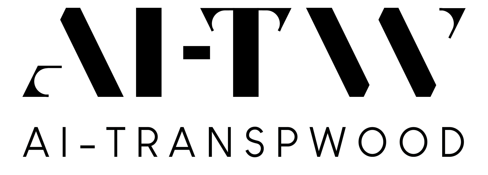

# AI-TranspWood

The AI-TranspWood project aims at an efficient integration of advanced AI-driven computational models with the SSbD (Safe and Sustainable by Design) framework for wood-based composites.
The project highlights this integration with the creation of new Transparent Wood composites, with the vision to integrate or even substitute concerning substances (plastic and glass) in construction, automotive, electronics, and furniture sectors.
To support this aim, the project offers user-oriented tools, including surrogate modeling and focused LCA tools, to industrial partners within and outside the consortium.

This organization contains a collection of all opensource code produced within the AI-TranspWood projects

## Partners

https://www.ai-transpwood-project.eu/partners

* Aalto University
* AIMPLAS
* BM Plastic
* CECAM
* Inuru GmbH
* KTH
* Latvijas Finieris
* Oyak Renault
* Politecnico di Torino
* Strane Innovation
* TU Wien
* UNISS
* VTT (VTT Technical Research Centre of Finland Ltd) **Project Leader**

## Links

* [Project website](https://www.ai-transpwood-project.eu/)
* [Facebook](https://www.facebook.com/profile.php?id=61558978967392)
* [Instagram](https://www.instagram.com/ai_transpwood_project/)
* [Linkedin](https://www.linkedin.com/company/ai-transpwood-project/about/)
* [X.com](https://twitter.com/AI_TranspWood)
* [YouTube](https://www.youtube.com/channel/UCREoQrdqr6VbBFqoVFGOz4Q)

## Funding

Co-funded by the European Union. Views and opinions expressed are however those of the author(s) only and do not necessarily reflect those of the European Union or HaDEA. Neither the European Union nor the granting authority can be held responsible for them.

HORIZON-CL4-2023-RESILIENCE-01 \
[101138191](https://cordis.europa.eu/project/id/101138191) - GAP-101138191 – AI-TRANSPWOOD
